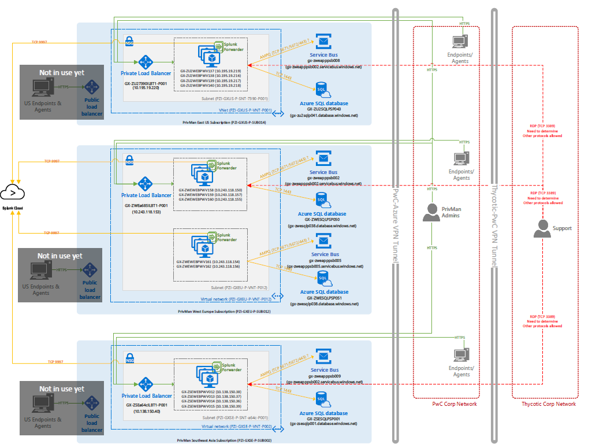
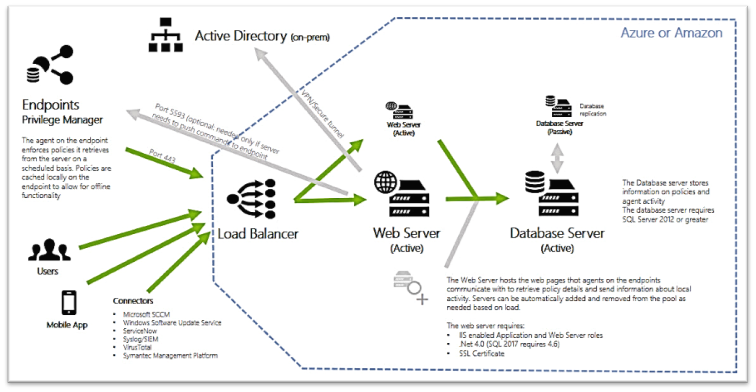
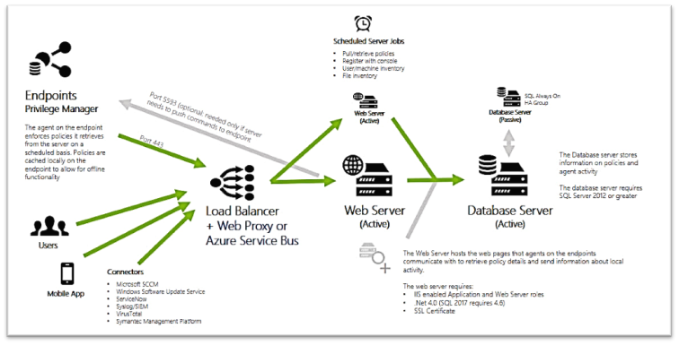

[title]: # (Introduction to Privilege Manager)
[tags]: # (Privilege Manager,Intro,)
[priority]: # (100) 
# Introduction to Privilege Manager

Privilege Manager is an endpoint least privilege and application control solution for Windows and Macs. Using Privilege Manager, administrators can automatically discover local administrator privileges and enforce the principle of least privilege through policy-driven actions. Those policy-driven actions include

* white-, black-, and gray-listing,
* application quarantine, sandbox, and isolation,
* application privilege elevation, and
* endpoint monitoring

All this is seamless for users, reduce IT/desktop support workload, and support compliance obligations.

Privilege Manager does not require Secret Server or any other Thycotic product to run. Secret Server's vaulting and workflow capabilities can be extended to privileged endpoint accounts when the two products are used together.

The typical Privilege Manager user is part of an IT team that is tasked with implementing and overseeing a company's security business requirements and framework. In the Privilege Manager product this role is known as the Privilege Manager Administrator. Although there are a few other kinds of Privilege Manager user roles (to be described further on) who may use Privilege Manager now and then for minor tasks, the Privilege Manager Administrator is the main user of Privilege Manager.

It is useful (although not necessary) for Privilege Manager Administrators to be familiar with the basics of IT administration, such as the Group Policy feature from Microsoft.

## Architecture Overview

<!--
### General Architecture

### Cloud Architecture for Azure and Amazon AWS Hosted Environments

### Proxy or Azure Bus Architecture for Environments without Internet Access

-->
